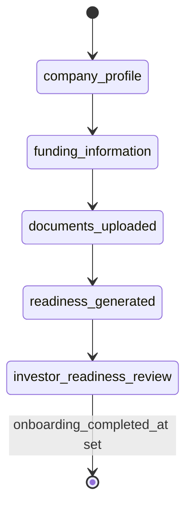
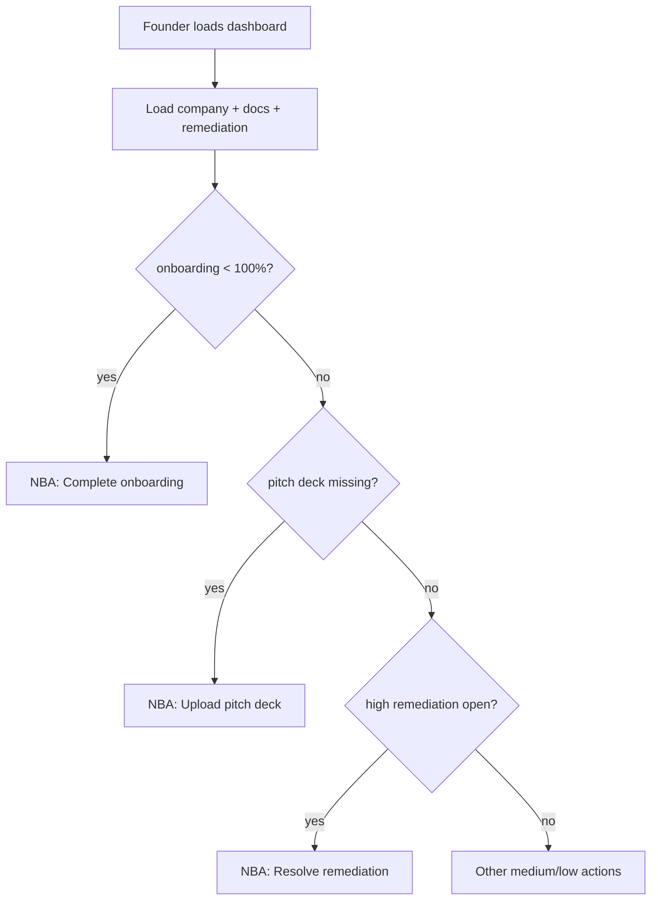
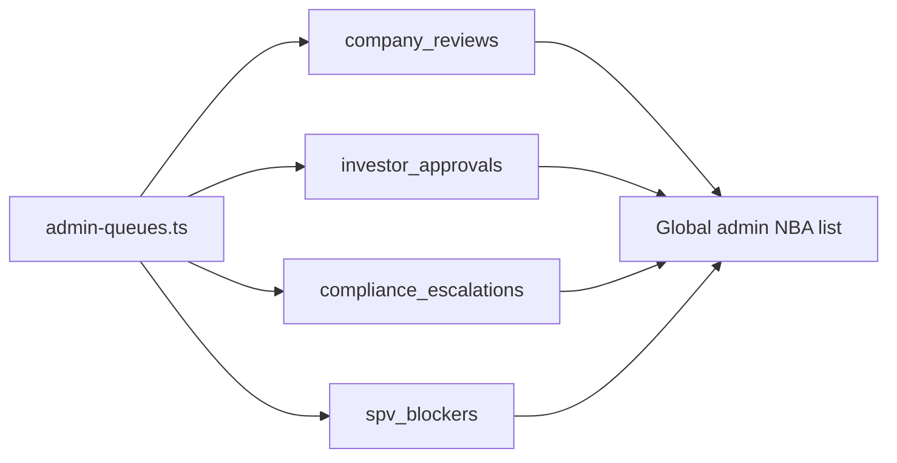

# CapitalOS Workflow Intelligence Readiness Audit

**Purpose:** Analyze the current CapitalOS codebase and data/workflow architecture to prepare for a future **Next Best Action (NBA) Engine**.

**Scope:** Analysis and documentation only. No migrations, API changes, or UI refactors.

**Audit date:** 2026-05-29

---

## Executive summary

CapitalOS already has strong **deterministic readiness signals** (founder onboarding %, remediation tasks, diligence reports, SPV operational readiness, investor matching scores) and **admin queue aggregation** (`admin-queues.ts`). A **CapitalOS Assistant** (Phase 1) exposes `suggestedActions` via rules, overlapping with future NBA goals. The **operational activity layer** (`operational_activity_events`) is staff-centric today with partial emitter coverage.

**Recommended data model:** **Option C — hybrid** (compute in Phase 1; persist dismiss/complete in Phase 2).

**Recommended next step:** Phase 1 — centralize `computeNextBestActions(role, context)` reusing onboarding, remediation, queues, SPV readiness, and `assistant-actions.ts`, surfaced on dashboards and workspaces without AI ranking.

---

## 1. Workflow state inventory

### 1.1 Summary matrix

| Domain | Primary storage | Status / enum values | Owner role | Typical blockers |
|--------|-----------------|----------------------|------------|------------------|
| Founder onboarding | `companies.onboarding_step_state`, `onboarding_progress_percent` | Steps: `company_profile`, `funding_information`, `documents_uploaded`, `readiness_generated`, `investor_readiness_review` | Founder | Incomplete profile, no pitch deck, no diligence report |
| Company review / publication | `companies.review_status`, `status`, `is_published`, `marketplace_visible` | Review: `pending`, `approved`, `rejected`, `changes_requested`; legacy `status` may overlap | Admin | Admin review pending, changes requested, not published |
| Diligence / readiness | `diligence_reports`, `companies` fields | Report rows per generation; score on report + company | Founder / Admin | Missing documents, low score |
| Remediation tasks | `founder_remediation_tasks` | `open`, `in_progress`, `completed`, `dismissed`; priority `high`/`medium`/`low` | Founder | High-priority open tasks |
| Learning progress | `founder_learning_progress`, `learning_programs` | Per-module: `not_started`, `in_progress`, `completed` | Founder | Modules incomplete |
| Investor onboarding / approval | `investor_profiles.approval_status` | `draft`, `submitted`, `approved`, `rejected`, `changes_requested` | Investor / Admin | Not submitted, admin pending |
| Investor interests | `investor_interests` | Interest level / pledge fields (see migration `0010`) | Investor | Company not marketplace-visible |
| Saved deals | `saved_deals` | Implicit via row existence | Investor | — |
| Intro requests | `intro_requests` | Row-based (no rich status enum in base migration) | Investor | Founder/admin routing |
| Messaging | `message_threads.status` | `requested`, `active`, `closed`, `archived` | Founder / Investor | Thread not active |
| Meetings | `thread_meetings.status` | `proposed`, `accepted`, `declined`, `canceled`, `scheduled` | Founder / Investor | Unaccepted proposal |
| Founder CRM / outreach | `founder_investor_contacts`, `founder_outreach_targets`, `outreach_campaigns`, `outreach_messages` | Contact: `new`→`archived`; Target: `recommended`→`archived`; Campaign: `draft`→`canceled`; Message: `draft`→`canceled` | Founder | Readiness gate, daily limits |
| Social drafts | `social_outreach_drafts` | `draft`, `reviewed`, `copied`, `archived`; compliance: `needs_review`, `approved`, `flagged` | Founder | Flagged compliance |
| Compliance events | `compliance_events` | `open`, `under_review`, `resolved`, `dismissed`; severity `low`–`critical` | Admin | Open critical/high |
| Notifications | `notifications` | `is_read` boolean; typed by `type` string | Per recipient | Unread backlog |
| Operational activity | `operational_activity_events` | Append-only; category + `event_type` | System / actors | Staff-only RLS Phase 1 |
| Admin queues | Computed in `admin-queues.ts` | Queue types (see §4) | Admin | N/A (derived) |
| Imports / exports | `import_batches`, export jobs | Import: `uploaded`, `previewed`, `confirmed`, `failed`, etc. | Admin | Failed rows |
| Reports | Generated via API | Ephemeral + operational event | Admin | — |
| SPV opportunities | `spv_opportunities.status` | `draft`, `under_review`, `open`, `closed`, `canceled` | Admin / Founder view | Checklist / investors |
| SPV participations | `spv_participations.status` | `invited`→`completed` / `declined` / `canceled` | Investor / Admin | Documents pending |
| SPV checklist | `spv_checklist_items.status` | `pending`, `in_progress`, `completed`, `waived` | Admin / Founder | Required items incomplete |
| SPV requirements | `spv_participation_requirements.status` | `pending`, `uploaded`, `under_review`, `approved`, `rejected`, `waived` | Investor / Admin | Pending review |
| Document packages | `spv_document_packages.status` | `not_started`→`archived` | Admin | Not approved |
| Closing reviews | `spv_closing_reviews.status` | `not_started`→`canceled` | Admin | Changes required |
| Billing / upgrade | `upgrade_requests`, `subscriptions` | Upgrade: `pending`, `reviewed`, `closed`; subscription_status enum in `0015` | Founder / Admin | Trial expired |
| RBAC | `internal_roles`, `internal_permissions`, assignments | Role slugs + permission slugs | Admin | Missing permission |

### 1.2 Domain details

#### Founder onboarding

| Attribute | Detail |
|-----------|--------|
| **Source files** | `src/lib/onboarding/progress.ts`, `src/app/api/founder/onboarding/route.ts`, `src/lib/onboarding/ensure-founder-setup.ts`, migration `0017` (onboarding columns on `companies`) |
| **Status values** | Step IDs in `ONBOARDING_STEP_IDS`; `onboarding_progress_percent` 0–100; `onboarding_completed_at` |
| **Meaning** | Linear checklist from profile → funding → documents → diligence → investor readiness review |
| **Transitions** | API PATCH updates step completion; auto-complete rules in `computeFounderOnboardingProgress` |
| **Owner** | Founder |
| **Blockers** | Auto-generated description, missing pitch deck, no diligence report, review not submitted |
| **Gaps** | `companies.status` vs `review_status` dual fields; submitted vs approved not always aligned in UI filters |



#### Company review / publication

| Attribute | Detail |
|-----------|--------|
| **Source** | `companies` table, `src/lib/data/admin.ts`, `src/lib/ui/query-filters.ts`, type `ReviewStatus` in `src/lib/supabase/types.ts` |
| **Values** | `review_status`: `pending`, `approved`, `rejected`, `changes_requested`; publication: `is_published`, `marketplace_visible`, `published_at` |
| **Transitions** | Admin review API routes; marketplace visibility separate from approval |
| **Owner** | Admin approves; founder submits |
| **Blockers** | `pending` / `changes_requested`; low onboarding % |
| **Gaps** | Filter logic sometimes uses `status` fallback (`review_status ?? status`) |

#### Diligence / readiness

| Attribute | Detail |
|-----------|--------|
| **Source** | `diligence_reports`, `src/lib/data/founder-readiness.ts`, remediation rules |
| **Values** | `readiness_score` on report; document checklist `missing` / `uploaded` / `needs_review` |
| **Transitions** | Report generation API / admin tools |
| **Owner** | Founder generates; admin may review documents |
| **Blockers** | Missing required doc types; score below thresholds in `READINESS_SCORE_THRESHOLD` |
| **Gaps** | `computeReadinessScore` in founder-readiness is heuristic (document count), may differ from AI diligence report score |

#### Remediation tasks

| Attribute | Detail |
|-----------|--------|
| **Source** | `src/lib/remediation/rules.ts`, `tasks.ts`, migration `0018` |
| **Values** | Status: `open`, `in_progress`, `completed`, `dismissed`; categories: profile, documents, financials, etc. |
| **Transitions** | Rule engine on readiness/onboarding changes; founder marks complete/dismiss |
| **Owner** | Founder |
| **Blockers** | High-priority `open` tasks |
| **Gaps** | No `due_at`; dedupe by `(company_id, source_key)` only |

#### Learning progress

| Attribute | Detail |
|-----------|--------|
| **Source** | Migrations `0019`, `0038`; `src/lib/learning/milestones.ts` |
| **Values** | Module status: `not_started`, `in_progress`, `completed` |
| **Transitions** | Founder completes lessons via learning UI |
| **Owner** | Founder |
| **Blockers** | Milestones require N modules (e.g. ≥2 for Investor Ready L1) |
| **Gaps** | Milestones computed in memory, not stored as enum |

#### Investor onboarding / approval

| Attribute | Detail |
|-----------|--------|
| **Source** | `investor_profiles`, `src/lib/investor/*`, admin investor review route |
| **Values** | `approval_status`: `draft`, `submitted`, `approved`, `rejected`, `changes_requested` |
| **Transitions** | Investor submits → admin approves/rejects |
| **Owner** | Investor + Admin |
| **Blockers** | `submitted` pending; matching returns 0 if not `approved` |
| **Gaps** | Profile completeness not a single DB field (computed in loaders) |

#### Investor interests, saved deals, intro requests

| Attribute | Detail |
|-----------|--------|
| **Source** | Migration `0010`, APIs under `src/app/api/investor/` |
| **Values** | Interests: pledge/interest fields; saved_deals: presence-based; intro_requests: row lifecycle |
| **Transitions** | Investor POST APIs; operational events on interest/save/intro |
| **Owner** | Investor |
| **Blockers** | Marketplace visibility, founder approval flows |
| **Gaps** | Limited operational events vs rich `investor_activity` CRM table |

#### Messaging & meetings

| Attribute | Detail |
|-----------|--------|
| **Source** | Migration `0022`, notification types for meetings |
| **Thread status** | `requested`, `active`, `closed`, `archived` |
| **Meeting status** | `proposed`, `accepted`, `declined`, `canceled`, `scheduled` |
| **Transitions** | Thread creation from intro; meeting propose/accept APIs |
| **Owner** | Founder / Investor |
| **Blockers** | Unread messages; proposed meetings |
| **Gaps** | **No operational activity emitters** for message/meeting events |

#### Founder CRM / outreach / social

| Attribute | Detail |
|-----------|--------|
| **Source** | Migrations `0025`, `0026` |
| **CRM contact status** | `new`, `researching`, `selected`, `contacted`, `responded`, `meeting_scheduled`, `not_interested`, `archived` |
| **Outreach target status** | `recommended` … `archived` |
| **Campaign status** | `draft`, `queued`, `active`, `paused`, `completed`, `canceled` |
| **Message status** | `draft`, `queued`, `sent`, `replied`, `bounced`, `canceled` |
| **Social draft** | `draft`/`reviewed`/`copied`/`archived`; compliance `needs_review`/`approved`/`flagged` |
| **Transitions** | Founder APIs; compliance scanners flag risky content |
| **Owner** | Founder |
| **Blockers** | Readiness gate (`outreach_without_readiness` event); daily queue limits |
| **Gaps** | Partial operational events (`outreach_without_readiness`, `social_draft_flagged`); no unified founder queue |

#### Compliance, notifications, operational activity

| Attribute | Detail |
|-----------|--------|
| **Compliance** | `compliance_events` + `src/lib/compliance/scanners.ts` — auto-created from outreach/messaging/social patterns |
| **Notifications** | `src/lib/notifications/types.ts` — 60+ types; insert helpers across app |
| **Operational** | `0044_operational_activity.sql` — 12 categories; visibility enum; dedupe via `metadata.dedupe_key` |

#### SPV stack

| Attribute | Detail |
|-----------|--------|
| **Opportunity** | `spv_opportunities.status`: draft → open → closed/canceled |
| **Operational readiness** | Computed: `draft`, `checklist_incomplete`, `document_ready`, `investors_pending`, `ready_for_legal_docs`, `closed` (`src/lib/spv/readiness.ts`) |
| **Participation** | `invited` … `completed` / `declined` / `canceled` |
| **Checklist item** | `pending`, `in_progress`, `completed`, `waived` |
| **Requirement** | `pending` … `waived` |
| **Package** | `not_started` … `archived` |
| **Closing review** | `not_started` … `canceled` |
| **Owner** | Admin operates; founder/investor read scoped views |
| **Gaps** | Many SPV transitions notify but **few emit operational events** except sync/status change |

#### Imports, exports, reports, billing, RBAC

| Domain | Key states | Source |
|--------|------------|--------|
| Imports | `import_batches.status`: uploaded, previewed, confirmed, failed, etc. | `0043`, `src/lib/imports/*` |
| Exports | Job completion + `export_generated` event | Admin export API |
| Reports | Ephemeral generation + `report_generated` event | `src/lib/reports/admin-reports.ts` |
| Upgrade requests | `pending`, `reviewed`, `closed` | `0016` |
| Subscriptions | `subscription_status` check constraint | `0015` |
| RBAC | `internal_roles.slug`: regular_user, manager, admin, super_admin | `0042`, `src/lib/rbac/*` |

#### Investor pipeline (admin CRM)

| Attribute | Detail |
|-----------|--------|
| **Source** | `investor_pipeline`, `investor_activity` migration `0012` |
| **Pipeline stage** | `interested`, `meeting_requested`, `follow_up` |
| **Activity types** | `saved_deal`, `expressed_interest`, `requested_intro`, `follow_up_requested` |
| **Owner** | Admin (pipeline); investor (activity source) |
| **Gaps** | **Separate from** `operational_activity_events` — dual activity systems |

---

## 2. Existing readiness / scoring systems

| System | Where calculated | Inputs | Outputs | Limitations | NBA-ready? |
|--------|------------------|--------|---------|-------------|------------|
| Founder onboarding % | `src/lib/onboarding/progress.ts` | Company fields, documents, diligence flag, review status | `percent`, `currentStep`, `isComplete` | Heuristic step completion; dual status fields | **Yes** — high signal |
| Readiness score | Diligence reports + `computeReadinessScore` heuristic | Documents, report AI output | `readiness_score`, history | Two scoring paths may diverge | **Yes** — prefer latest `diligence_reports` row |
| Diligence reports | Generation APIs / admin | Documents, company profile | `readiness_score`, `missing_documents` | Not real-time on every upload | **Yes** — trigger regen action |
| Remediation generation | `src/lib/remediation/rules.ts` | Company, docs, score, review | Tasks with priority, `recommended_action` | No due dates | **Yes** — map 1:1 to NBA |
| Learning progress | Learning data loaders | Module completion rows | % complete, module counts | Milestones derived | **Yes** |
| Learning milestones | `src/lib/learning/milestones.ts` | Onboarding %, docs, score, remediation | `ReadinessMilestone[]` met/pending | Not persisted | **Yes** — excellent Phase 1 |
| Investor profile completeness | Investor loaders / onboarding UI | `investor_profiles` fields | Implicit in UI | No single score field | **Partial** — rules-based checklist |
| Investor–company match | `src/lib/matching/investor-company-matching.ts` | Sectors, stage, geo, check size, readiness, marketplace flags | `matchScore` 0–100, reasons | Only approved investors; marketplace filter | **Yes** — investor NBA |
| SPV operational readiness | `src/lib/spv/readiness.ts` | SPV status, checklist %, participations, requirements | Status + `getSpvNextAction` | Not legal readiness | **Yes** |
| Checklist / package / closing % | `src/lib/spv/display.ts`, DB columns | Checklist items, packages, closing review | `checklist_readiness_pct`, `package_readiness_pct`, `closing_readiness_pct` | Updated on sync | **Yes** |
| Investor document readiness | `spv_participation_requirements` | Per-participation requirements | pending/uploaded/approved counts | Admin review queue | **Yes** |
| Admin queue counts | `src/lib/queues/admin-queues.ts` | Multiple tables aggregated | Per-queue counts + items | No SLA, no assignee | **Yes** — admin NBA source |

---

## 3. Operational activity coverage

### 3.1 Schema (migration `0044`)

| Field | Purpose |
|-------|---------|
| `event_type`, `event_category` | Taxonomy |
| `entity_type`, `entity_id` | Primary entity |
| `actor_user_id`, `actor_role` | Who triggered |
| `company_id`, `investor_id`, `spv_id`, `related_user_id` | Scoping |
| `severity` | `info` … `critical` |
| `visibility` | `admin_only`, `internal`, `founder`, `investor`, `company_related`, `public_summary` |
| `metadata` | JSON; supports `dedupe_key` (15-min window default) |
| `source_module` | Provenance |

**RLS:** Staff read-only in Phase 1 (`is_staff()`).

**Sanitization:** `src/lib/operational-activity/sanitize.ts` strips tokens, bodies, internal notes, storage paths.

### 3.2 Event categories (DB constraint)

`crm`, `onboarding`, `diligence`, `compliance`, `spv`, `investor`, `founder`, `reporting`, `messaging`, `outreach`, `system`, `imports`, `analytics`

### 3.3 Known emitters (`emitOperationalEvent` / compliance)

| Event type | Emitter | Category |
|------------|---------|----------|
| `founder_onboarding_completed` | Founder onboarding API | onboarding |
| `investor_interest_expressed` | Investor interests API | investor |
| `investor_deal_saved` | Saved deals API | investor |
| `investor_intro_requested` | Intro requests API | investor |
| `import_previewed`, `import_completed` | Admin imports | imports |
| `export_generated` | Admin exports | reporting |
| `report_generated` | Admin reports | reporting |
| `spv_readiness_updated` | SPV sync-readiness API | spv |
| `spv_status_changed` | SPV opportunity PATCH | spv |
| `compliance_event_created` | Compliance service | compliance |
| `assistant_opened`, `assistant_question_asked` | Assistant chat API | system |
| Scanner-derived | `src/lib/compliance/scanners.ts` | compliance |

Compliance scanners also reference: `social_draft_flagged`, `risky_fundraising_language`, `outreach_abuse`, `messaging_risky_phrase`, `trial_abuse_pattern`, `investor_review_rejection`, `missing_onboarding_data`, `high_risk_company`, etc.

### 3.4 Coverage matrix

| Workflow | Emits operational event? | Alternate audit |
|----------|--------------------------|-----------------|
| Founder onboarding complete | Yes | Notifications |
| Document upload | **No** | Documents table only |
| Diligence report generated | **No** | Report row |
| Remediation task created/completed | **No** | Notifications |
| Learning module completed | **No** | Notifications |
| Company review approve/reject | **No** | Notifications |
| Investor approval | Partial (rejection scanner) | Notifications |
| Messaging / meetings | **No** | `thread_messages`, notifications |
| Outreach campaign/message | Partial (compliance) | CRM tables |
| SPV participation/requirement changes | **No** (except sync/status) | Many SPV notification types |
| Billing / trial | Partial (scanner) | Notifications |
| Founder CRM contact updates | **No** | `founder_investor_contacts` |
| `investor_activity` / `investor_pipeline` | **No** | Dedicated CRM tables |

### 3.5 Duplicated systems

| System A | System B | Risk |
|----------|----------|------|
| `operational_activity_events` | `investor_activity` | Admin timeline incomplete for investor CRM |
| `operational_activity_events` | `notifications` | Different audience; not deduped |
| `compliance_events` | Compliance-related operational events | Two admin surfaces |
| Assistant `suggestedActions` | Future NBA | Logic drift |

### 3.6 Recommendations

1. **Unify on operational events** for cross-role timelines with correct `visibility`.
2. **Emit from notification helpers** (single choke point) to avoid gaps.
3. **Standardize `dedupe_key`** per `(event_type, entity_id, day)`.
4. **Do not expose raw message bodies** in metadata (already sanitized).
5. **Backfill high-value types:** `document_uploaded`, `remediation_task_created`, `company_review_status_changed`, `spv_requirement_uploaded`.

---

## 4. Queue architecture audit

### 4.1 Admin queue types (`ADMIN_QUEUE_TYPES`)

| Queue type | Source query | Severity logic | Drill-down href |
|------------|--------------|----------------|-----------------|
| `company_reviews` | `companies` where `review_status` in pending/changes_requested | `medium` if changes_requested else `info` | `/admin/companies/{id}` |
| `investor_approvals` | `investor_profiles` approval_status = submitted | Default | `/admin/investors/{profile_id}` |
| `compliance_escalations` | Open compliance events | By event severity | Compliance filters |
| `spv_blockers` | SPVs with incomplete readiness / pending requirements | Warning/danger | `/admin/spv/{id}` |
| `investor_documents` | Requirements `uploaded`/`under_review` | Medium+ | SPV/investor paths |
| `founder_remediation` | Open remediation high/medium | Priority-based | Company workspace |
| `imports_exports` | Failed/stuck import batches | Danger | `/admin/imports` |

**Filters:** `?queue=`, `search`, `severity`, `status` via `AdminQueueFilters`.

**Item shape:** `AdminQueueItem` — id, queue_type, title, subtitle, entity refs, severity, status, next_action_label, href, metadata, created_at.

### 4.2 What works

- Single aggregator for admin dashboard and company workspace `queueItems`
- Entity links (company_id, investor_id, spv_id)
- Search and severity filters
- Readiness metadata on company reviews

### 4.3 Gaps for NBA engine

| Gap | Impact |
|-----|--------|
| No `due_at` on queue items | Cannot rank overdue work |
| No `assigned_to` | No ownership model |
| No SLA / escalation | False urgency risk if added naively |
| No founder/investor queues | Role-specific NBA must compute separately |
| No queue for upgrade requests, message backlog, learning | Admin/founder blind spots |
| Priority is per-queue, not global | Cross-queue ranking hard |
| `created_at` only | Stale items not deprioritized |

### 4.4 NBA readiness

**Admin:** Strong foundation — extend `admin-queues.ts` with scoring function.

**Founder/Investor:** Use remediation + onboarding + SPV loaders, not queues table.

---

## 5. Notification architecture audit

### 5.1 Table & helpers

- **Table:** `notifications` (`0021`) — recipient, actor, type, title, message, entity_type/id, is_read
- **Types:** `src/lib/notifications/types.ts` (60+ types including SPV, compliance, trial, outreach)
- **Unread:** Index on `(recipient_user_id, is_read)` where unread
- **Dedupe:** Per-helper logic (not global); varies by type

### 5.2 Role targeting

| Audience | Examples |
|----------|----------|
| Founder | Remediation, learning, company review, outreach blocked, SPV updates |
| Investor | Approval, meetings, SPV requirements |
| Admin | Compliance, investor submissions (via staff recipients) |

### 5.3 Reuse for action reminders

| Reusable | Missing for digests/escalations |
|----------|--------------------------------|
| Type taxonomy maps to workflow domains | No `priority` on notification row |
| entity_type/id for deep links | No grouping / digest batching |
| is_read for inbox UX | No snooze / dismiss |
| Rich SPV coverage | NBA would duplicate if not linked |

### 5.4 Risks

- **Noise:** SPV generates many notification types per state change
- **Duplication:** Same workflow may notify + compliance event + no operational event
- **NBA connection:** Notifications should reference `action_type` key in Phase 3, not replace NBA computation

---

## 6. Assistant architecture audit

### 6.1 Components

| Piece | Path |
|-------|------|
| Types / context | `src/lib/assistant/types.ts`, `assistant-context.ts` |
| Loaders | `load-founder/investor/admin-assistant-context.ts` |
| Suggested actions | `src/lib/assistant/assistant-actions.ts` |
| Policy | `src/lib/assistant/assistant-policy.ts` |
| API | `POST /api/assistant/chat` |
| UI | `src/components/assistant/CapitalOSAssistant.tsx` |

### 6.2 Modes

- Role-based: `founder`, `investor`, `admin`, `analyst`
- **Learning mode:** Delegates to `runPersonalCoach` on `/founder/learning/*` (assistant hidden)

### 6.3 `suggestedActions` structure

```typescript
{ label, href, type: 'workflow'|'report'|'learning'|'integration', priority: 'high'|'medium'|'low' }
```

Built deterministically from sanitized summary counts (remediation, pending reviews, SPV requirements, etc.). **No ranking score** — order is push order. Dedupes by `href`.

### 6.4 Safety

- Read-only policy; no legal/investment advice prompts
- Sanitized context (no secrets, limited fields)
- OpenAI with template fallback
- Operational logging: `assistant_opened`, `assistant_question_asked` (service role)

### 6.5 NBA integration assessment

| Can feed NBA | Missing |
|--------------|---------|
| Rule patterns in `assistant-actions.ts` | Entity-specific recommendations (per company/investor id) |
| Summary metrics in loaders | Global priority ranking |
| Related links in responses | Persistence / dismiss |
| | Separate from queue severity |
| | Admin analyst role parity |

**Recommendation:** Extract `buildSuggestedActions` → shared `computeNextBestActions` used by assistant **and** dashboards.

---

## 7. Entity workspace readiness

### 7.1 Company workspace (`AdminCompanyWorkspaceData`)

| Section | Available | Timeline | Queue | Action links |
|---------|-----------|----------|-------|--------------|
| Company card + founder | Yes | Yes (`timeline`) | Yes (`queueItems`) | `nextAction` in readiness/compliance |
| Readiness (score, onboarding, remediation) | Yes | Partial | Via remediation queue | `/founder/readiness` implied |
| Investor activity counts | Yes | No per-event | No | — |
| SPV summaries | Yes | Partial | SPV blockers queue | `nextAction` per SPV |
| Compliance | Yes | Recent events | Yes | Admin compliance |
| Documents / diligence | Yes | No | No | Missing pitch deck hints |

**Missing recommendation slots:** Dedicated “Next best actions” panel; ranked list; founder-visible subset N/A (admin only).

### 7.2 Investor workspace

Loaded via admin investor workspace loaders (pattern mirrors company). Includes approval status, matching summaries (`getInvestorMatchingSummaries`), pipeline/activity counts.

**Gaps:** No unified `queueItems` on investor workspace; matching score not surfaced as actions.

### 7.3 SPV workspace

SPV admin pages use `readiness.ts`, checklist, packages, closing reviews.

**Gaps:** No persisted NBA; `getSpvNextAction` is label-only string.

### 7.4 Where NBA should appear (Phase 1)

| Surface | Role |
|---------|------|
| `/founder` dashboard | Founder NBA cards |
| `/investor` dashboard | Investor NBA cards |
| `/admin` dashboard + `/admin/queues` | Admin global + queue context |
| Company / investor / SPV admin workspaces | Top 3 entity-scoped actions |
| Assistant panel | Same engine as structured `suggestedActions` |

---

## 8. Candidate next-best-actions catalog

### 8.1 Founder actions

| Action | Trigger | Priority | Entity | href | Source | Blockers | Phase 1 safe? |
|--------|---------|----------|--------|------|--------|----------|---------------|
| Complete onboarding | `onboarding_progress_percent` < 100 | High | company | `/founder/onboarding` | `progress.ts` | — | **Yes** |
| Upload pitch deck | No PITCH_DECK document | High | company | `/founder/documents` | documents | — | **Yes** |
| Resolve remediation task | `remediationActive > 0` | High if priority high | company | `/founder/readiness` | `founder_remediation_tasks` | — | **Yes** |
| Improve readiness score | score < threshold | Medium | company | `/founder/readiness` | diligence report | Needs report first | **Yes** |
| Complete learning module | modules < milestone threshold | Medium | company | `/founder/learning` | learning progress | — | **Yes** |
| Add investor contacts | contacts count = 0 | Low | company | `/founder/crm` | CRM tables | — | **Yes** |
| Draft outreach campaign | readiness OK, no active campaign | Medium | company | `/founder/outreach` | campaigns | Readiness gate | **Yes** |
| Publish update | social draft ready | Low | company | `/founder/social` | social_outreach_drafts | Flagged compliance | **Caution** — check compliance_status |
| Review SPV status | founder has SPVs with pending checklist | Medium | spv | `/founder/spv` | spv readiness | — | **Yes** |

### 8.2 Investor actions

| Action | Trigger | Priority | Entity | href | Source | Blockers | Phase 1? |
|--------|---------|----------|--------|------|--------|----------|--------|
| Complete investor profile | approval not submitted/approved | High | investor | `/investor/onboarding` | investor_profiles | — | **Yes** |
| Submit approval | draft complete | High | investor | `/investor/onboarding` | profile fields | — | **Yes** |
| Review matched opportunity | matchScore ≥ 70 | Medium | company | `/investor/opportunities` | matching | Not approved | **Yes** |
| Express interest | saved deal, no interest | Medium | company | marketplace company | saved_deals | Marketplace | **Yes** |
| Request intro | interest exists, no intro | Medium | company | company page | intro_requests | — | **Yes** |
| Schedule meeting | proposed meeting pending | High | meeting | `/investor/messages` | thread_meetings | — | **Yes** |
| Complete SPV requirement | requirement status pending | High | spv | `/investor/spvs` | requirements | — | **Yes** |
| Review company update | notification type | Low | company | marketplace | notifications | — | **Yes** |

### 8.3 Admin actions

| Action | Trigger | Priority | Entity | href | Source | Blockers | Phase 1? |
|--------|---------|----------|--------|------|--------|----------|--------|
| Review pending company | queue count > 0 | High | company | `/admin/companies/{id}` | admin-queues | RBAC | **Yes** |
| Approve investor | submitted profiles | High | investor | `/admin/investors/{id}` | queue | permission | **Yes** |
| Resolve compliance event | open critical/high | Critical | compliance | admin compliance | compliance_events | — | **Yes** |
| Review SPV blocker | spv_blockers queue | High | spv | `/admin/spv/{id}` | readiness | — | **Yes** |
| Review uploaded investor requirement | uploaded/under_review | Medium | requirement | SPV workspace | requirements | — | **Yes** |
| Generate diligence report | no recent report | Medium | company | admin company | diligence_reports | — | **Yes** |
| Review failed import | import failed | High | import | `/admin/imports` | import_batches | — | **Yes** |
| Check system health | manual / future | Low | system | `/admin` | metrics | — | **Defer** |

---

## 9. Priority / ranking model proposal (Phase 1)

### 9.1 Design principles

- **Deterministic only** — no LLM ranking in Phase 1
- **Explainable** — each action includes `reason` string
- **Role-scoped** — never cross-tenant leakage

### 9.2 Suggested priority levels

| Level | Score range | Examples |
|-------|-------------|----------|
| P0 — Critical | ≥ 900 | Open compliance `critical`, blocking SPV legal phase |
| P1 — High | 700–899 | High remediation, investor approval queue, pending requirements review |
| P2 — Medium | 400–699 | Onboarding < 100%, match opportunity, proposed meeting |
| P3 — Low | < 400 | Learning nudge, CRM empty state |

### 9.3 Scoring weights (additive)

| Factor | Weight | Notes |
|--------|--------|-------|
| Critical blocker | +400 | compliance severity critical, or hard gate |
| Due / overdue | +300 | Phase 2 when `due_at` exists; use `next_follow_up_at` for outreach |
| Compliance severity | +50–200 | Map high=150, medium=80 |
| Readiness impact | +20–100 | High remediation = 100; +1 per missing doc type |
| Workflow stage | +30–80 | Submitted > draft |
| Role entitlement | Filter | Exclude actions user cannot perform (RLS) |
| Activity recency | −10 per week idle | Deprioritize stale (optional Phase 1.1) |
| Dependency chain | +200 | Parent action incomplete (e.g. onboarding before outreach) |

### 9.4 Deterministic ranking

1. Compute score per candidate action
2. Sort descending by score, then `created_at` asc (FIFO for ties)
3. Cap: 5 global dashboard, 3 per entity workspace
4. Dedupe by `(action_type, entity_id)`

### 9.5 What should NOT use AI initially

- Priority ordering
- Compliance severity classification
- Investor matching scores (already rules-based)
- Legal/SPV readiness labels
- Whether outreach is allowed (use existing gates)

---

## 10. Data model recommendation

### 10.1 Recommendation: **Option C — Hybrid**

| Phase | Approach |
|-------|----------|
| Phase 1 | Compute dynamically on request; cache in memory per request |
| Phase 2 | Persist dismiss/complete/snooze |
| Phase 3+ | Sync with notifications digests |

**Rationale:** Avoid stale rows early; need user state (dismissed) before persistence adds value.

### 10.2 Proposed table (Phase 2 — do not migrate yet)

`next_best_actions`

| Field | Type | Notes |
|-------|------|-------|
| id | uuid | PK |
| user_id | uuid nullable | null = role-wide admin action |
| role | text | founder / investor / admin |
| entity_type | text | company, investor, spv, … |
| entity_id | uuid | |
| company_id | uuid nullable | denormalized scope |
| investor_id | uuid nullable | |
| spv_id | uuid nullable | |
| action_type | text | stable key e.g. `upload_pitch_deck` |
| title | text | |
| description | text nullable | |
| priority | text | P0–P3 or integer score |
| status | text | `active`, `dismissed`, `completed`, `expired` |
| href | text | |
| source_module | text | e.g. `remediation`, `admin_queues` |
| source_event_id | uuid nullable | FK operational_activity_events |
| metadata | jsonb | reasons, scores |
| due_at | timestamptz nullable | |
| dismissed_at | timestamptz nullable | |
| completed_at | timestamptz nullable | |
| created_at / updated_at | timestamptz | |

**RLS:** Row owner `user_id = auth.uid()` OR staff for admin-scoped rows.

---

## 11. Security / privacy audit

### 11.1 Visibility by role

| Role | May see | Must not see |
|------|---------|--------------|
| **Founder** | Own company, remediation, documents metadata, own SPV founder view, own CRM | Other founders’ data, investor PII beyond platform interactions, admin internal notes, compliance internal notes |
| **Investor** | Approved marketplace, own interests, messages, own SPV requirements | Unapproved company drafts, founder CRM notes, compliance events, other investors’ profiles |
| **Admin/Staff** | Workspaces, queues, compliance, operational events (staff RLS) | Service role keys, raw OAuth tokens, message bodies in operational metadata |

### 11.2 Service-role risks

- `emitOperationalEvent(createServiceRoleClient())` in onboarding + assistant bypasses user RLS — acceptable if insert-only and sanitized
- Investor APIs use `auth.serviceSupabase` for events — ensure no founder-only data in investor-visible events
- **Risk:** Over-broad metadata in events → mitigated by `sanitize.ts`

### 11.3 RLS implications for NBA

- Computed actions must use **user-scoped Supabase client**, not service role, for founder/investor surfaces
- Admin NBA may use staff client + `is_staff()` / RBAC permission checks (`manage_companies`, etc.)
- Never include: `internal_notes`, `admin_feedback`, full message `body`, storage `file_path`, investor email from CRM in investor-facing actions

### 11.4 Sensitive fields blacklist for NBA metadata

Align with `SENSITIVE_METADATA_KEYS` in sanitize.ts plus: accreditation documents, tax IDs, bank details.

---

## 12. Implementation roadmap

### Phase 1 — Computed NBA (4–6 weeks)

- `src/lib/next-best-actions/compute.ts` — extract rules from `assistant-actions.ts`, remediation, onboarding, queues, SPV readiness
- Surface on founder/investor/admin dashboards + workspace headers
- Unit tests for scoring determinism
- **No DB migration**

### Phase 2 — Persisted actions

- `next_best_actions` table + RLS
- Dismiss / complete APIs
- Sync engine on login (recompute + merge)

### Phase 3 — Notifications / digests

- Daily digest email/in-app grouped by priority
- Link notifications to `action_type`
- Escalation: P0 unread > 24h → admin alert

### Phase 4 — AI-assisted prioritization

- LLM re-ranks top 10 with explanations only (human-readable)
- Policy guardrails; never auto-execute

### Phase 5 — Workflow automation

- Optional auto-create remediation from events
- Webhooks / calendar triggers

---

## 13. Risk matrix

| Risk | Severity | Mitigation | Timing |
|------|----------|------------|--------|
| Incorrect recommendations | High | Deterministic rules; unit tests; href validation | Phase 1 |
| Over-notification | Medium | Separate NBA from notifications until Phase 3 | Phase 3 |
| Privacy leakage | Critical | User-scoped queries; metadata blacklist; review service-role emits | Phase 1 |
| Duplicated logic | Medium | Single `computeNextBestActions` module | Phase 1 |
| Stale actions | Medium | Recompute on load; TTL in Phase 2 | Phase 2 |
| False urgency | Medium | Avoid red badges without P0 criteria | Phase 1 |
| AI overreach | High | No autonomous actions; advisory text only | Phase 4+ |
| Performance cost | Medium | Cap actions; parallel loaders; no N+1 | Phase 1 |

---

## 14. Workflow diagrams

### 14.1 Founder readiness → NBA



### 14.2 Admin queue → NBA



---

## 15. Final report

### 15.1 Files analyzed

**Migrations:** `0001`–`0044` (focus: `0010`, `0012`, `0015`–`0022`, `0025`–`0028`, `0030`–`0036`, `0038`–`0039`, `0042`–`0044`)

**Core libs:** `src/lib/onboarding/progress.ts`, `src/lib/remediation/*`, `src/lib/learning/milestones.ts`, `src/lib/matching/investor-company-matching.ts`, `src/lib/spv/readiness.ts`, `src/lib/queues/admin-queues.ts`, `src/lib/operational-activity/*`, `src/lib/notifications/types.ts`, `src/lib/compliance/*`, `src/lib/assistant/*`, `src/lib/admin/company-workspace-types.ts`, `src/lib/data/admin.ts`, `src/lib/data/founder-readiness.ts`

**APIs (emitters):** founder onboarding, investor interests/saved-deals/intro, admin imports/exports/reports, SPV sync/status, assistant chat, compliance scanners

### 15.2 State systems found

**30+** distinct status enums across onboarding, company review, remediation, learning, investor approval, CRM/outreach, messaging, meetings, social drafts, compliance, SPV stack (opportunity, participation, checklist, requirements, packages, closing), imports, billing, RBAC.

### 15.3 Readiness/scoring systems found

**12** major systems — onboarding %, diligence/heuristic readiness, remediation rules, learning milestones, investor matching (0–100), SPV operational readiness + next action labels, checklist/package/closing percentages, admin queue aggregations.

### 15.4 Operational event coverage summary

**~15** explicit emitters; compliance scanners add more. **Major gaps:** documents, remediation, learning, company review, messaging/meetings, most SPV participation transitions. **Dedupe:** supported via `metadata.dedupe_key` (15 min). **Duplication:** `investor_activity` vs operational events.

### 15.5 Queue readiness summary

**7** admin queue types with filters and drill-down links. **Missing:** due dates, assignment, SLA, founder/investor queues, global cross-queue ranking.

### 15.6 Assistant readiness summary

Phase 1 assistant provides **deterministic `suggestedActions`** and sanitized context — **direct precursor to NBA**. Extract shared compute module; add entity-scoped and ranked actions.

### 15.7 Candidate next-best-actions summary

**27** cataloged actions (9 founder, 8 investor, 8 admin) with triggers and Phase 1 safety flags. Majority are **safe for Phase 1**; social/outreach need compliance guards.

### 15.8 Recommended data model approach

**Option C — Hybrid:** compute first, persist dismiss/complete in Phase 2.

### 15.9 Top risks

1. Privacy leakage via service-role event metadata  
2. Incorrect recommendations from dual readiness scores  
3. Logic duplication (assistant vs queues vs future NBA)  
4. False urgency without SLA model  

### 15.10 Recommended next implementation step

Implement **`src/lib/next-best-actions/compute.ts`** (pure functions) that merges:

- `computeFounderOnboardingProgress`
- `summarizeRemediationTasks`
- `getSpvNextAction` / `computeSpvOperationalReadinessStatus`
- `ADMIN_QUEUE_TYPES` item mapping for admin
- `buildSuggestedActions` rules

Wire to founder/investor/admin dashboard components **without** schema changes.

### 15.11 Confirmation

**No application code, migrations, packages, or business logic were modified** as part of this audit. Only this documentation file was created.

---

*Document version: 1.0 — CapitalOS Workflow Intelligence Readiness Audit*
